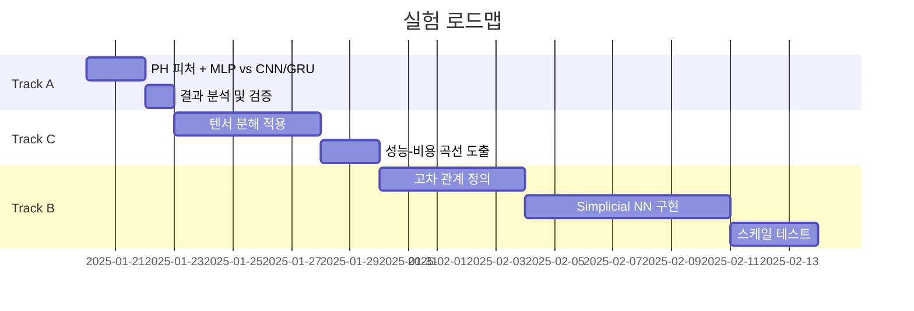

# PRD: Topology-Efficient Deep Learning

## 1. 개요

### 1.1 프로젝트 목표
위상/구조 수학(Topological Data Analysis, Tensor Decomposition)을 활용하여 딥러닝 모델의 **계산 효율성**을 검증한다.

### 1.2 핵심 가설
> "위상/구조 수학을 써서 총 계산량(FLOPs·메모리·학습시간)을 줄이거나, 같은 계산량에서 성능을 올릴 수 있다."

### 1.3 대상 도메인
- 시계열 데이터 (금융, 센서, 인프라 메트릭)
- 그래프/관계 데이터 (협업, 코드, 인프라)
- 고차 관계 데이터 (팀, 그룹, 공동원인)

---

## 2. 실험 트랙

### Track A: Persistent Homology 기반 피처 압축 (시계열)

#### 가설
원본 입력(고차원·긴 시계열) 대신 위상 요약 피처를 사용하면, 더 작은 모델로도 유사 성능을 달성하여 추론 비용을 크게 절감할 수 있다.

#### 태스크
| 분류 | 예시 |
|------|------|
| 시계열 분류 | 이상탐지, 상태분류 (센서, 트래픽, 헬스) |
| 금융 | 변동성 구간 분류, 급락 이벤트 분류 |

#### 데이터
- UCR/UEA time-series classification (빠른 검증용)
- 도메인 특화 데이터 (금융/인프라/로그)

#### 위상 변환 방법
1. **Sliding window embedding**: 길이 w 창으로 포인트클라우드 변환
2. **Takens embedding**: [x(t), x(t+τ), ..., x(t+(d-1)τ)]
3. **STFT/스펙트로그램**: 이미지로 변환 후 cubical complex PH

#### 모델 구성

**Baseline**
- Tiny 1D-CNN / GRU / TCN (small/medium/large)
- Small Transformer (optional)

**Proposed**
```
입력 → 임베딩/윈도잉 → Persistence Diagram (H0/H1)
                          ↓
              Vectorization (landscape/image/stats)
                          ↓
                    Tiny MLP (2층)
                          ↓
                      분류/회귀
```

**Hybrid (optional)**
- 작은 CNN/TCN → PH → 작은 헤드

#### 성공 기준
- 성능 하락 ≤ 1%p (F1) + 추론시간 ≥ 30% 절감
- 또는 동일 추론시간에서 성능 +1~2%p 개선

---

### Track B: Simplicial/Cell Complex 기반 고차 관계 모델링 (그래프)

#### 가설
실제 관계가 3자 이상 고차 관계를 가진다면, 그래프 attention보다 고차 복합체 기반 메시지패싱이 더 적은 연산으로 더 잘 일반화할 수 있다.

#### 태스크
| 분류 | 예시 |
|------|------|
| 협업/조직 | 프로젝트 성공 예측, 이탈 예측 |
| 코드 그래프 | 취약점/버그 위치 예측 |
| 인프라 | 장애 전조 탐지 |

#### 데이터 구성
- 기본: 그래프 G=(V,E) 또는 하이퍼그래프
- 고차 관계 구축:
  - 동일 시간창 내 공동 발생 이벤트
  - 동일 트랜잭션/세션/릴리즈 내 엔티티
  - 팀-서비스-런북 같은 그룹 단위

#### 모델 구성

**Baseline**
- GCN / GraphSAGE
- GAT
- Hypergraph NN (optional)

**Proposed**
- Simplicial NN / Cell Complex NN
- 0/1/2-simplex 피처 + 경계/코경계 기반 업데이트
- 핵심: 구조가 정의한 이웃만 메시지 전달 (전역 attention 회피)

#### 효율 비교
- GAT vs 복합체 모델의 밀도별 비용 비교
- 스케일 업 실험: n=10k→100k, 밀도 증가 시 latency/VRAM 변화

#### 성공 기준
- 큰 그래프/높은 밀도에서 동일 성능 대비 VRAM/latency 절감
- 또는 동일 latency 대비 성능 우위

---

### Track C: 텐서 분해 기반 가중치 압축

#### 가설
큰 Linear/Conv를 텐서 네트워크로 치환하면 파라미터와 연산량이 감소하고, 성능을 크게 잃지 않거나 regularization 효과로 개선될 수 있다.

#### 적용 대상
- Track A/B 모델 중 가장 무거운 블록
- Transformer FFN (Linear→GELU→Linear)
- 큰 MLP 헤드

#### 모델 구성

**Baseline**
- 원본 모델 (FFN width w)
- 일반 압축: Pruning / LoRA / Low-rank Linear

**Proposed**
- FFN의 Linear를 TT/MPO/저랭크 텐서로 대체
- Rank 조절로 성능-비용 곡선 획득

#### 측정 항목
- Rank별: 성능, 파라미터 수, 추론시간, 학습 안정성
- 동일 파라미터 수에서 LoRA/저랭크 대비 성능 비교

#### 성공 기준
- 파라미터 30~70% 절감에서 성능 유지 (또는 소폭 하락)
- 추론시간 유의미 감소

---

## 3. 공통 실험 원칙

### 3.1 목표 지표

| 카테고리 | 지표 |
|----------|------|
| 정확도/성능 | Task별 표준 지표 (F1, AUROC, MAE, MSE 등) |
| 효율 | 학습 시간, 추론 지연(ms), 처리량(samples/s) |
| 리소스 | 파라미터 수, Peak VRAM, FLOPs |
| 복합 | 성능/추론시간, 성능/FLOPs |

### 3.2 공정 비교 조건

- 동일 데이터 split, early stopping 기준
- 동일 최적화기/스케줄러 (AdamW + cosine)
- 튜닝 횟수 제한 (베이스라인과 동일)

#### 비교 방식
1. **Capacity-matched**: 동일 파라미터 수
2. **Latency-matched**: 동일 추론 시간

### 3.3 보고 항목
- 평균 ± 표준편차 (시드 3~5개)
- Ablation: 위상/구조 요소 제거 시 변화

---

## 4. Ablation 설계

### Track A
| 변수 | 범위 |
|------|------|
| PH 차수 | H0만 vs H0+H1 |
| 윈도 길이 | [16, 32, 64, 128] |
| 지연 차수 | [2, 3, 4, 5] |
| Vectorization | Landscape vs Image vs Stats |

### Track B
| 변수 | 범위 |
|------|------|
| 복합체 구조 | 2-simplex 포함 vs 제거 (그래프 환원) |
| 구축 규칙 | 시간창 크기, co-occurrence 임계값 |
| 메시지패싱 깊이 | 2/4/6 layers |

### Track C
| 변수 | 범위 |
|------|------|
| 적용 범위 | FFN만 vs Attention projection까지 |
| Rank 스케줄 | 학습 중 증가 vs 고정 |
| Rank 값 | [4, 8, 16, 32, 64] |

---

## 5. 실행 로드맵



**우선순위**
1. Track A (1-2일): 빠른 승부, "작은 모델로도 된다" 검증
2. Track C: 실질 계산 절감 확대
3. Track B (2-3주): 데이터 구성이 핵심

---

## 6. 기술 스택

| 분류 | 도구 |
|------|------|
| 프레임워크 | PyTorch, PyTorch Lightning |
| 그래프 | PyTorch Geometric |
| TDA | ripser / gudhi / giotto-tda |
| 측정 | torch.profiler, nvprof/nsys, fvcore |
| 실험관리 | wandb / MLflow |

---

## 7. 산출물

### 7.1 리포트 구조
1. 문제/가설 (1페이지)
2. 데이터/표현 (위상 변환 포함)
3. 모델/베이스라인/공정 비교 조건
4. 결과: 성능 vs latency, 성능 vs params, 성능 vs VRAM
5. Ablation
6. 실패 케이스/조건부 결론

### 7.2 코드 산출물
- 재현 가능한 실험 스크립트
- 설정 파일 (config.yaml)
- 결과 시각화 노트북

---

## 8. 리스크 및 완화

| 리스크 | 완화 방안 |
|--------|----------|
| PH 계산 오버헤드 | 사전 계산 및 캐싱, 근사 알고리즘 사용 |
| 텐서 분해 커널 비효율 | 실측 기반 판단, 최적화된 라이브러리 탐색 |
| 고차 관계 정의 모호성 | 도메인 전문가 협업, 다중 정의 비교 실험 |
| 소규모 데이터에서 일반화 | 교차 검증, 다중 데이터셋 검증 |
